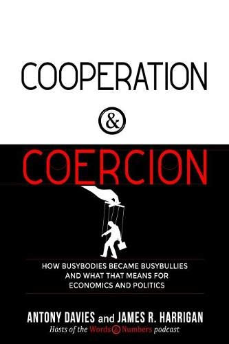
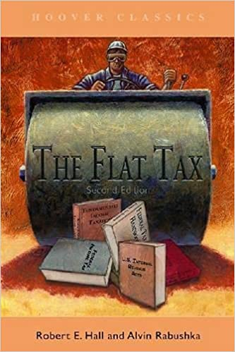
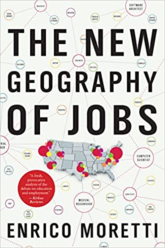
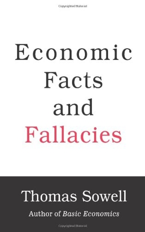
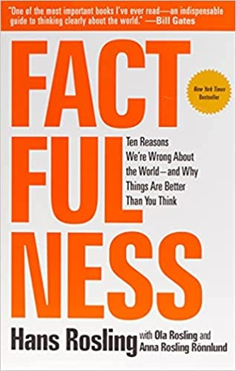
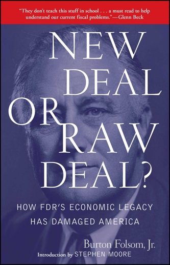

# Economic and Computer Science Research
Economics is my primary discipline followed by computer science. This page  contains some of the books and research papers that I have read as well as some of the analysis that I have done.

## Written analysis
This paper was written for the Truman State Bulldog Student Investment fund for its quarterly Macroeconomic analysis. It was written in conjunction with other fund members. I was responsible for writing the Technology analysis as well as contributing to the U.S. analysis.
https://ipfs.io/ipfs/QmNZihN1VCZLbpuZjpXeE11cEFXVWYKhFgLPz1v2VF8cRD?filename=fall_2021_macroeconomic_analysis.pdf (This file might take a while to load because it is hosted on IPFS)

# Books and Papers
I ensure that I am always moving forward and obtaining more knowledge so I make sure to keep up with news as well as read books and research daily. This list contains recent books and papers that I have consumed.

| Cooperation and Coercion | Author: Antony Davies and James Harrigan |
| -------------------- | -----------: |
|   Antony Davies and James Harrigan are the host of the Words and Numbers podcast. This book is about how humans interact with each other. They interact through either cooperation or coercion as the title suggests. This book breaks down many topics through this lens and they discuss issues with current government policies.   | |

| The Flat Tax and The Fair Tax      | Author: The Fair Tax was written by Neal Boortz and John Linder and The Flat Tax by Robert Hall and Alvin Rabushka   |
| ----------- | ----------- |
|        |        |
| Nobody likes taxes. What if tax policy did not have to be as it is now, a jumbled incoherent mess. These books offer two alternative solutions to the current predicament that is the United States tax code. While it is possible these solutions are might not work and many people would disagree they still bring light to a big problem   | 

| The New Geography of Jobs       | Author: Enrico Moretti |
| ----------- | ----------- |
|        |        |
| Enrico Moretti dives deep into why jobs are located where they are and what impact that  moving cities has on everyday people. The New Geography of Jobs is one of my favorite books and does a good job exploring the impact the decision of where you live can have.| |

| Economic Facts and Fallacies     |  |
| ----------- | ----------- |
|  Author: Thomas Sowell       |        |
| This is a Thomas Sowell book about common economic misconceptions. It covers everything from Income fallacies to academic fallacies.| 
        |

| Factfulness      | Author: Hans Rosling |
| ----------- | ----------- |
|        |        |
|  Factfulness by Hans RoslingFactfulness is a fantastic book about developing a fact based worldview. The primary purpose of this book is to inform people of common instincts that they have and how to overcome them to gain key insights into how the world really works. This book is essential for any person that works with large datasets because people are prone to assume things about these datasets and can unintentionally derive false conclusions.(more information about this here https://www.gapminder.org/)   | 
        |

| Building Decentralized Blockchain Applications      | Author: Shahid Shaikh |
| ----------- | ----------- |
|        |        |
| If you are looking for a good overview of how blockchains and web3 works this is a good book to gain that foundational knowledge. It contains content on how blockchain works, smart contracts, Ethereum, Ganache, Solidity, IPFS, and much more.   | 
        |

  | New Deal or Raw Deal      | Author: Burton Folsom jr. |
| ----------- | ----------- |
|         |        |
| In the time of the great depression what impact did FDR’s New Deal have on the economy? It might not be what you think. You truly do have to read this book to understand an alternative viewpoint of government policy.| 
        |      

| Scroogenomics      | Author: Joel Waldfogel |
| ----------- | ----------- |
|        |        |
| This book is all about how holiday giving in most scenarios hurt levels of consumer surplus. This book is a short read but is an excellent mix of psychology economics and holiday cheer.   | 
        |